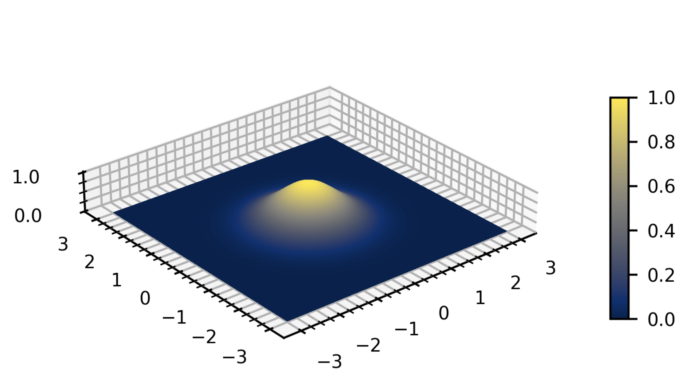
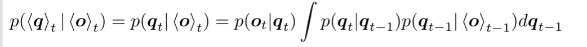
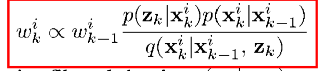

# portfolio2 from Group 10, Dongxu Liu, Blesson Manjakunnel
Run run_partickle_filter.ipynb

# Transition Models
transition_models.py
## Normal 2d noises

## Uniform Distributed in circle
## Student T
Like Normal Distribution, but with arguments v and scale, can have more thin or wide distribution.
Here I use two 1D Student T, assume that x, y has independent noise.

# Observation Models
BallObservation
## NormalObservation
Only for one ball
## GMMObservation
In multi-target (e.g., multi-ball) particle filter tracking simulations, we often face complex observation characteristics:
- The observation (e.g., an image or heatmap) contains multiple peaks, each corresponding to a ball.
- The detections may overlap or include noise.
- A single Gaussian model is insufficient to capture multi-modal observation likelihoods.
Using a Gaussian Mixture Model (GMM) as the observation model becomes a natural and powerful choice.
A GMM can represent multiple peaks in the observation likelihood.
Each Gaussian component models the observation of one ball.
The combined model naturally expresses multi-ball scenarios.
## NearestNormalObservation
Simliar to GMM, just only pick the max likelihoods of multi Normal distribution.
## UnorderedStudentTObservation
Similar to GMM, just use multi 1D student distribution.
## NearestStudentTObservation
Similar to NearestNormalObservation, use max Likelihood from components distribution.

# Particle Filter

Sampling Importance Resampling Filter
## Resample
Sample particles using the weights given by last observation.
### Multinomia Resample
Treats the process of selecting new particles as drawing from a multinomial distribution. 
- Simplicity: Easiest to understand and implement.
- High Variance: Because each draw is independent, there's a higher chance of sampling the same particle multiple times or completely missing some particles that should be sampled based on their weight. This leads to higher variance in the number of copies each particle receives.

### System Resample
Systematic resampling aims to reduce the variance introduced by Multinomial Resampling by introducing some systematic structure to the random draws. Instead of N independent draws, it uses a single random draw to generate N evenly spaced "pointers" across the cumulative weight distribution.

- Lower Variance: By forcing the random points to be evenly spaced, it ensures a more "fair" distribution of selections, reducing the variance in the number of copies each particle receives compared to Multinomial Resampling.
- Efficient: Computational complexity is typically O(N) because you can efficiently traverse the cumulative distribution with the ordered points.
- Widely Used: Often preferred due to its balance of simplicity and efficiency with reduced variance.

### Residual Resample
Residual resampling addresses the problem of particles with very high weights directly by guaranteeing that they are copied a certain minimum number of times. It splits the resampling process into two stages: an deterministic integer part and a stochastic fractional part.

## Propagate
Update particles with transition model.

## Evaluation
Update weights with Important Sampling.

We use transition distribution as q, the proposal distribution, so we can just use the normalized likilihoods of observation model.
